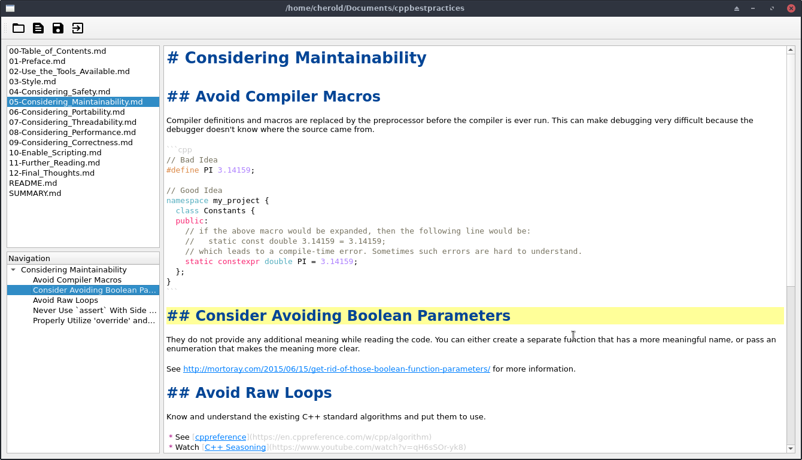

# Dependencies
* Qt >= 5.15.1
* CMake >= 3.5
* Compiler that supports C++17

# Build & Execute
```sh
> mkdir build && cd build
> cmake ..
> make -j
> ./qcmddocs
```




# Todos
* Add Git for versioning and synchronizing documents using libgit2
